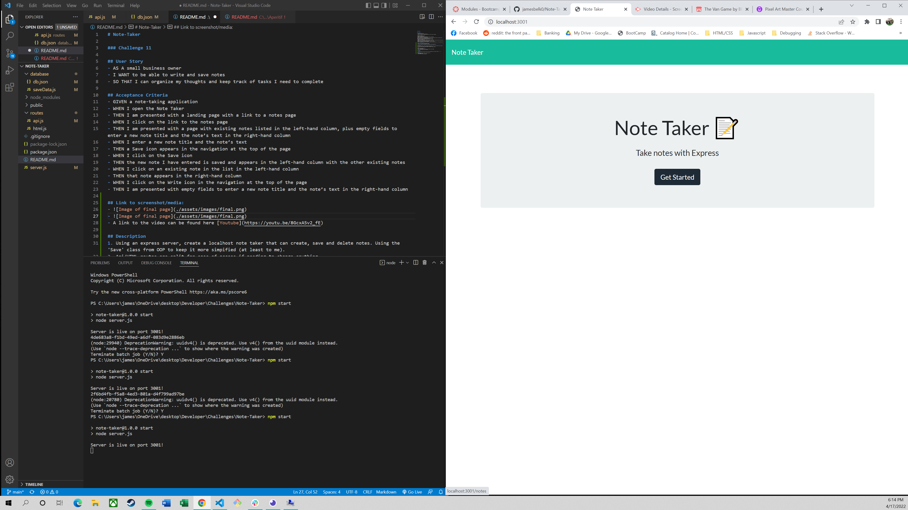

# Note-Taker

### Challenge 11

## User Story
- AS A small business owner
- I WANT to be able to write and save notes
- SO THAT I can organize my thoughts and keep track of tasks I need to complete

## Acceptance Criteria
- GIVEN a note-taking application
- WHEN I open the Note Taker
- THEN I am presented with a landing page with a link to a notes page
- WHEN I click on the link to the notes page
- THEN I am presented with a page with existing notes listed in the left-hand column, plus empty fields to enter a new note title and the note’s text in the right-hand column
- WHEN I enter a new note title and the note’s text
- THEN a Save icon appears in the navigation at the top of the page
- WHEN I click on the Save icon
- THEN the new note I have entered is saved and appears in the left-hand column with the other existing notes
- WHEN I click on an existing note in the list in the left-hand column
- THEN that note appears in the right-hand column
- WHEN I click on the Write icon in the navigation at the top of the page
- THEN I am presented with empty fields to enter a new note title and the note’s text in the right-hand column

## Link to Code
- http://github/jamesbelk0/Note-Taker

## Link to Heroku
- https://nameless-journey-59567.herokuapp.com/

## Link to screenshot/media:
- 
- 
- A link to the video can be found here [Youtube](https://youtu.be/8GcxA5v2_fE)

## Description
1. Using an express server, create a localhost note taker that can create, save and delete notes. Using the 'Save' class from OOP to keep it more simpified (at least to me). 
2. Api/HTML routes are split for ease of access if needing to change anything. 

## Usage
- Start a server using 'npm start'
- pull up 'localhost:3001'
- Click on 'Get Started' and create/pull up/ or delete a note as needed
- Enjoy your memory support tool! (I need one)

## Contributor
- James Belk
- Luiz (TA) helped with some code structure and why my pathways were not working. (missed a ../../)

## Questions
If there are any issues or questions, please contact at:
- <jamesbelk0@gmail.com>
- [GitHub](https://github.com/jamesbelk0)